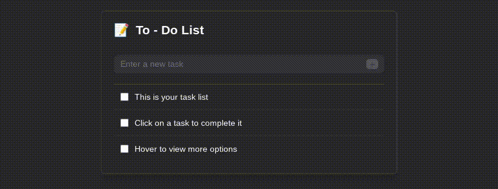

<h1 align="center">
  To-Do List App
</h1>

This is a simple to-do list built with React and Tailwind CSS. It includes full CRUD (Create, Read, Update, Delete) functionality, with intuitive features that allow users to easily mark tasks as complete by clicking on the text, edit tasks by clicking the end of the text, and quickly delete tasks using the backspace key. The to-do list also handles longer tasks that span multiple lines, responsively scales with the browser, saves tasks in local storage, and displays a secret message when you delete all of the tasks. You can view the deployed build at: <a href="https://www.acelowder.com/todo">https://www.acelowder.com/todo</a> or by clicking the image below.

&nbsp;

  

## Future Plans
If I have time to come back to this project, I plan to add the following features:
- **Drag and Drop**: Reorder tasks via drag and drop.
- **Quick Add**: Quickly add tasks by pressing enter on the bottom task.
- **Bulk Delete**: Hold backspace to remove multiple tasks at once.

&nbsp;

## Reflections

If I were to redo this project, I would plan the visuals beforehand on Figma. I initially believed that to-do apps were simple enough to skip planning. However, this caused me to do multiple css rewrites. Thankfully, Tailwind CSS made these adjustments much easier.
